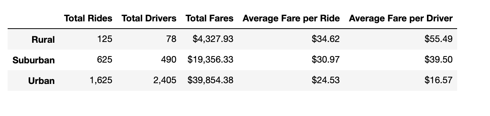
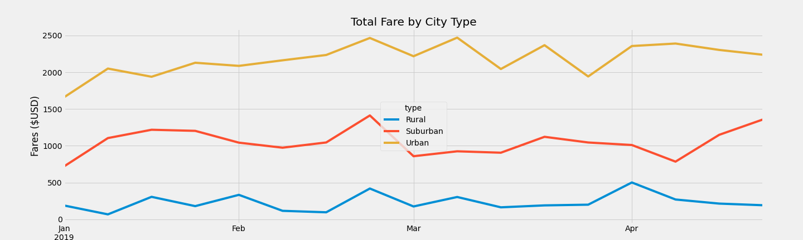

# PyBer_Analysis

## Overview of the analysis: 
In this analysis, we analyzed data on PyBer rides for three types of cities, rural, suburban, and urban to find the average fare per ride and average fare per driver in each city type. We also created a DataFrame to display the total amount of money earned in each type of city each week between January 1, 2019 and April 28, 2019. This information was then displayed in a multiple line graph to better compare the differences. 

## Results: 

When we separate the data into city type to compare the average fare per ride and the average fare per driver, we see a few interesting patterns. The total fares per city type also follows a predictable pattern that the rural areas make the least with suburban making about 5 times the rural amount and urban areas making the most with nearly 10 times the total fares of the rural cities. We also see that the more urban areas have a significantly higher number of total rides and total drivers, than the suburban and rural areas. This can be expected with a more populated area and more potential demand for PyBer services.

Interestingly, these differences in drivers and rides only translate to an average of 4$ more per ride for the rural rides over the suburban ones, $10 more per ride for the rural rides over the urban. This may indicate that the rides are longer in the rural areas resulting in larger fares. The lowest average fare per driver is with urban drivers who average $16.67 per driver. There is a more than 3 fold difference in the average fare per driver for the rural drivers at $55.49 per driver while the suburban drivers make nearly 2.5 the average fare of urban drivers with $39.50 per driver. This indicates that more drivers working in the more populated areas translates to lower average fares for those drivers. 

In the multiple line chart for the Total Fare by City Type, we see that the highest earning city type is the Urban, with suburban cities and rural cities making less fares respectively. Over the weeks from early January 2019 to late April 2019, the total fares for each city type appear to be relatively flat within the city types without much variation. 

## Summary: 
Based on these results, we believe that the disparities among the city types can be addressed in a few different ways. First, there may be too many drivers per rides in the urban areas. There is an average of 1.6 rides per driver in rural areas, 1.3 rides per driver in suburban areas, and 0.7 rides per driver in urban areas, meaning that there are more drivers than possible rides. To address this, we believe further analysis is needed to evaluate if there is an ideal number of drivers per population. Is there a need for these additional drivers per rides in order to shorten wait times or increase availability? Or does it just limit the drivers’ average fares, possibly resulting in less satisfied drivers and lower driver retention. This further evaluation should also include an analysis of how to maximize average fares per driver. This maximization analysis may lead to limits on the number of drivers in a given area, based on the population and rates of rides. 

Additional analysis may need to be performed to assess the length of the rides and how that affects the average fares per ride and average fare per driver. If the length of rides is significantly different in rural areas, then the possibility of a sliding scale or tiered structure for the fare price based on length of ride should be considered. We believe that these further analyses can help address the differences in fares among city types and result is a more uniformity is the average fares per ride and average fare per driver.  

